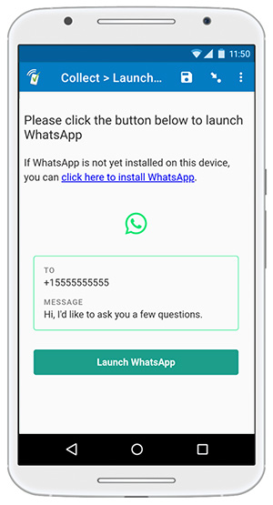

# Launch WhatsApp

## Description

This plugin allows you to launch [WhatsApp](https://www.whatsapp.com/) using pre-populated info from your form. You can provide a phone number, a message, or both. 

### Data format

This field plug-in requires the `text` field type.

When the green button is pressed, the WhatsApp message information is stored in the field’s response in the following format:
> WhatsApp: name=`name`; number=`number`; message="`message`"  

*Please note:* this message will be saved when the user clicks the green button. There is no way to verify whether or not WhatsApp was actually launched, a call was made, or a message was sent. Only the parameters that were supplied to the field plug-in will be recorded.

## How to use

### Getting started

1. Download the test form [extras/test-form](https://github.com/surveycto/launch-whatsapp/raw/master/extras/sample-form/Launch%20WhatsApp.xlsx) from this repo and upload it to your SurveyCTO server.
1. Download the [launch-whatsapp.fieldplugin.zip](https://github.com/surveycto/launch-whatsapp/raw/master/launch-whatsapp.fieldplugin.zip) file from this repo, and attach it to the test form on your SurveyCTO server.
1. Make sure to provide the correct parameters (see below).

### Parameters

| Key | Value |
| --- | --- |
| `number` (optional) | The destination phone number (the full phone number in international format, without leading zeroes). This phone number does not need to be in the caller's contact list, but it does need to be a valid WhatsApp number (i.e., the phone number must be registered to a WhatsApp account).|
| `name` (optional) | The name of the recipient. If supplied, this will be shown in the preview instead of the phone number. 
| `message` (optional) | The body of the text message. |
| `button_label` (optional) | If you want to override the default button label, "Launch WhatsApp", you can supply your own label with the `button_label` parameter. |

*Note:* it is suggested to use values stored in other fields for these parameters. Take a look at the test form to see how this is accomplished.

## More resources

* **Test form**  
[extras/Launch WhatsApp.xlsx](https://github.com/surveycto/launch-whatsapp/raw/master/extras/sample-form/Launch%20WhatsApp.xlsx)
* **Developer documentation**  
Instructions and resources for developing your own field plug-ins.  
[https://github.com/surveycto/Field-plug-in-resources](https://github.com/surveycto/Field-plug-in-resources)
* **User documentation**  
How to get started using field plug-ins in your SurveyCTO form.  
[https://docs.surveycto.com/02-designing-forms/03-advanced-topics/06.using-field-plug-ins.html](https://docs.surveycto.com/02-designing-forms/03-advanced-topics/06.using-field-plug-ins.html)
